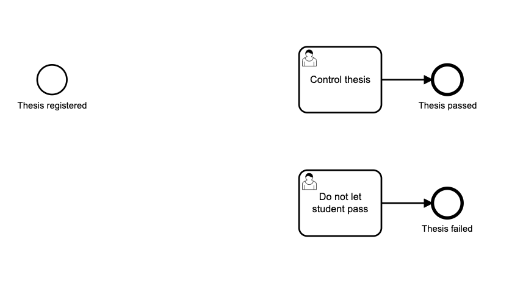

## Event based gateway

Digitizing the registration and submission of a thesis - is that possible? Of course!

In the following task, you will have to deal with exactly that.
The process is very simplified and consists of the following steps:

- It starts with the registration of the thesis. There, the topic and name of the student must be specified.
- Then you wait for the thesis to be submitted or the deadline of 12 weeks (1 minute for testing) to expire.
- When the thesis is handed in, it must be checked by the professor (mary)
- If the deadline for submission is exceeded, the exam committee (john) must not allow the student to pass.


### 1. Complete the process



Remember the task - we are talking about event based gateways!

### 2. Configure the Events

Configure the message and timer event you (hopefully) modeled

### 3. Send the message

In our case we will simulate the student request by an API call using [Postman](https://www.postman.com/downloads/). A documentation of the Message API from Camunda can be found [here](https://docs.camunda.org/manual/7.15/reference/rest/message/post-message/)

Send the message to the correct process instance when submitting. Attention - only one process instance may be found for the correlation.

Correlation keys are used to assign to the correct process instance. 
Process variables are set as new variables when the message is delivered

```
{
  "messageName" : "yourMessageName",
  "correlationKeys" : {
    "student" : {"value" : "yourStudentInput", "type": "String"}
  },
  "processVariables" : {
    "variable1" : {"value" : "Your thesis", "type": "String"}
  }
}
```