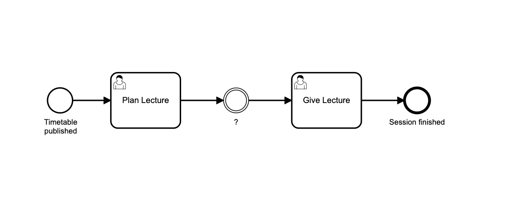

### Timer Events
Timer events are triggered by a defined timer. They can be used to start a process, as intermediate events or as boundary events. The timer itself can be a defined Date, a Duration or a Cycle.

In our first process, we will take a deep dive into the extensive jobs of your profs. Let's consider the high-level process of planning and giving lectures:

Your first task is to enter the process variables into the model and check the successful execution in the Camunda web interface.
Let's start with configuring the timer event. Select the event and Choose "Duration" as a Timer Definition Type. 
After that you need to provide a timer definition. The specification of seconds, minutes, days, months etc. is defined according to [ISO 8601](https://en.wikipedia.org/wiki/ISO_8601#Durations). For our case, it should be sufficient to use a timer from a few seconds to a few minutes.
Enter *P0Y0M0DT0H1M0S* in the field for a duration of 1 minute.
Also test the process for a duration of *P0Y0M0DT0H0M30S*seconds by entering T30S.

Next try to pass a date to the timer event. The formatting is again done according to ISO 8601. An example for this is: 
*2021-06-01T12:00:00*
Deploy the process and test if the execution works as intended.

The third option *Cycle* makes no sense in our use case and will not be executed successfully. This definition type is often used for periodically starting processes for maintenance or other QA systems. The formatting of the intervals also follows ISO 8601, for further information see the [Camunda docs](https://docs.camunda.org/manual/7.15/reference/bpmn20/events/timer-events/).