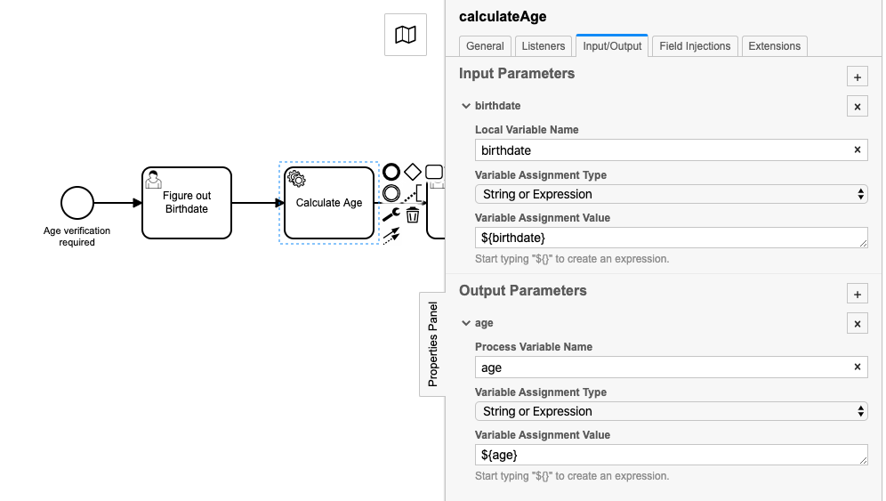

# Service Tasks
Take a look at the following age verification process:


Let's say you are working in a liquor store and a suspiciously young looking guy wants to buy a bottle of Whiskey. You'll have to start a process to verify his age. At first you take a look at his ID in order to figure out his birthdate. Afterwards you'll calculate his age and ultimately check the data you have created during this process.


In this exercise, you'll learn how to automate tasks. In our example we will automate the "Calculate age" task. But first, let's have a look at which information has to be provided and processed at which task. 

## Variables
Open the Camunda app, navigate to the Tasklist and start a new *age_verification* process instance. 
Claim the appearing "Figure out birthdate"-task and enter a birthdate of your choice to the form.


After you have completed the first task, open the appearing "Calculate age"-task, claim it and click "load variables". You'll see the first variable *birthdate* and the value you entered to the form. Manually add a variable called "age", pass the age you have calculated and hit "complete". The review task let's you review the data and your calculations... You don't really benefit from that function at this point, but as soon as you have automated the "Calculate age"-task, this will give you the chance to ensure your code did what it was supposed to do.
The creation and consumption of variables looks like this: 


Both variables, *birthdate* and *age*, are defined as global process variables at this point. In order to provide some reusability for your BPMN-elements and design them robust enough to perform in larger processes, we will map the variables as input- and Output-variables. Although this is not mandatory for our simple process, you will benefit from following this best practice when you start to work with processes that contain several subprocesses, where variables are reused several times in different scopes.
To introduce the variables locally, open the Camunda Modeler and navigate to the "Input/Output"-tab of the "Calculate Age"-task and enter the the corresponding values.



## Automation
### Delegates
Next, cast the task to a servicetask, open the "General"-tab in the Properties Panel and and choose "Delegate Expression" in the "Implementation"-filed. The code for this delegate is already included in the exercise-application project. Enter 
```
${ageCalculationDelegate}
```
in the "Delegate Expression" textfield, to call it as soon as the task is started.
Now redeploy your process and test the execution. Did the servicetask calculate the age correctly?

If everything is working, try to switch the "Check data"-task to a servicetask aswell. Use this template for the new Java class and let the method print the birthdate and the calculated age in the console. Check the "AgeCalculationDelegate.java" class to find out which methods are used to fetch the fetch the required input.

```java
@Component("yourDelegateName")  
@RequiredArgsConstructor  
public class YourDelegateName implements JavaDelegate {  
  @Override  
  public void execute(DelegateExecution execution) throws Exception{  
  //input:
  
  //processing:  
  System.out.println("Age and birthdate here");  
  
  //output:  

  }  
}
```

### External tasks
Delegate Expressions allow you to automate tasks by coding the business logic directly into your local project. But let's say you want to outsource some tasks or have to set up an information exchange across company borders. In this case you will make use of the *External* servicetasks.
In order to give you an idea how to do this, we will just use our age verification process and make the "Calculate age" task an external task. Therefore, open the Camunda Modeler and change the implementation of the task to "External". This allows the task to be fetched from the API - as soon as its execution is started by the process engine. And in order to fetch it, we will need to build a client.

Have a look at the [Camunda Docs](https://docs.camunda.org/manual/latest/user-guide/ext-client/spring-boot-starter/) for detailed information about external tasks and the capabilities of the Camunda framework.

In order to build a client, you have to use the *ExternalTaskClient* interface, provided by the Camunda library, to specify the API and then subscribe the client to a specific task of your process.
A skeleton of an external client looks like this:

```java
//build the client by passing the entry point to the Java API and providing a timeout duration  
ExternalTaskClient client = ExternalTaskClient.create()  
        .baseUrl("http://localhost:8080/engine-rest")  
        .asyncResponseTimeout(10 * 1000)  
        .build();  
  
//subscribe to an external task by specifying the "topic"-description as in the diagram  
client.subscribe("taskName")  
        .lockDuration(50 * 1000)  
        .handler((externalTask, externalTaskService) -> {  
			
			//Fetch the variables:
			String variable = (String) externalTask.getVariable("variableName");
			
			/*
			Add your business logic here
			 */
  
			externalTaskService.complete(externalTask, variables);  
			})  
        .open();
```

Try to implement the client and check if it fetches the external task.
A sample project containing a client that is configured to fetch the *calculateAge* task from the age verification process can be found here:
[Link to Repo](/repo.git)
